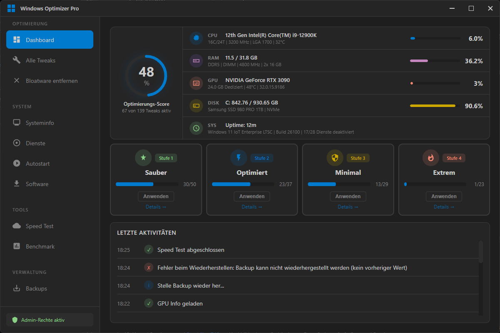

# 📸 Bilder zu GitHub & Website hinzufügen

## 🎯 Wo speicherst du Bilder?

### Für GitHub Repository:
```
github-repo/
└── screenshots/
    ├── main-window.png      (Hauptfenster)
    ├── privacy-tab.png      (Datenschutz Tab)
    ├── performance-tab.png  (Performance Tab)
    ├── services-tab.png     (Dienste Tab)
    └── banner.png           (Header-Bild für README)
```

### Für deine Website:
```
website/
└── images/
    ├── screenshots/
    │   ├── screenshot1.png
    │   └── screenshot2.png
    └── logo.png
```

---

## 📋 Schritt-für-Schritt: Screenshots erstellen

### 1. App starten & Screenshots machen

```bash
# Starte deine App
cd C:\Users\Georgios\Desktop\WinOpt\github-repo
npm start
```

**Windows Screenshot-Tools:**
- **Snipping Tool** (Windows + Shift + S)
- **Screenshot** (Windows + PrtScn)
- **ShareX** (kostenlos, empfohlen!) - https://getsharex.com/

### 2. Screenshots benennen

**Gute Namen:**
✅ `main-window.png`
✅ `privacy-settings.png`
✅ `before-after-performance.png`

**Schlechte Namen:**
❌ `Unbenannt-1.png`
❌ `screenshot_20250112_123456.png`

### 3. Screenshots optimieren

**Zu groß?** Komprimiere sie:
- Online: https://tinypng.com/
- Desktop: https://imageoptim.com/

**Empfohlene Größe:**
- Breite: 1280-1920px
- Format: PNG (für UI) oder JPG (für Fotos)
- Dateigröße: < 500 KB pro Bild

---

## 🔧 Bilder zu GitHub hinzufügen

### Option A: Im README einbinden

**1. Screenshots in Ordner legen:**
```
github-repo/screenshots/main-window.png
```

**2. Im README.md verwenden:**
```markdown
## Screenshots

### Hauptfenster


### Datenschutz-Einstellungen


### Vorher/Nachher Vergleich

```

**3. Zu Git hinzufügen:**
```bash
git add screenshots/
git commit -m "Add: Screenshots für README"
git push
```

### Option B: GitHub als Bild-Host nutzen

**1. Gehe zu einem Issue/PR auf GitHub**
2. **Drag & Drop** das Bild ins Textfeld
3. GitHub generiert eine URL:
   ```
   https://user-images.githubusercontent.com/...../image.png
   ```
4. **Kopiere die URL** und nutze sie im README:
   ```markdown
   
   ```

---

## 🌐 Bilder zur Website hinzufügen

### 1. Ordner für Website-Bilder erstellen

```bash
mkdir C:\Users\Georgios\Desktop\WinOpt\website\images
mkdir C:\Users\Georgios\Desktop\WinOpt\website\images\screenshots
```

### 2. Bilder kopieren

Kopiere deine Screenshots nach:
```
website/images/screenshots/
```

### 3. In index.html einbinden

**Galerie hinzufügen (nach der Features-Section):**

```html
<!-- Screenshots Section -->
<section class="screenshots-section" style="padding: 100px 0; background: var(--bg-secondary);">
    <div class="container">
        <div class="section-header">
            <h2>Screenshots</h2>
            <p>Schau dir an wie die App aussieht</p>
        </div>

        <div class="screenshot-grid">
            
            
            
            
        </div>
    </div>
</section>
```

**CSS für die Galerie (in styles.css):**

```css
/* Screenshots Grid */
.screenshot-grid {
    display: grid;
    grid-template-columns: repeat(auto-fit, minmax(400px, 1fr));
    gap: 30px;
    margin-top: 40px;
}

.screenshot-img {
    width: 100%;
    border-radius: 12px;
    border: 1px solid var(--border-color);
    transition: transform 0.3s ease, box-shadow 0.3s ease;
    cursor: pointer;
}

.screenshot-img:hover {
    transform: scale(1.05);
    box-shadow: 0 10px 40px rgba(0, 212, 255, 0.3);
}
```

---

## 🎨 Banner/Hero-Bild erstellen

### Für GitHub README:

**1. Erstelle ein Banner (1200x630px)**
- Tools: Canva, Figma, Photoshop
- Template: https://www.canva.com/templates/

**2. Speichere als:**
```
github-repo/screenshots/banner.png
```

**3. Im README oben einfügen:**
```markdown
# Windows Optimizer Pro


Ein modernes Tool zur Windows-Optimierung...
```

---

## 💡 Best Practices

### ✅ Do's:

- **Komprimiere Bilder** (< 500 KB)
- **Benenne sinnvoll** (main-window.png statt img1.png)
- **Nutze PNG** für UI-Screenshots
- **Nutze JPG** für Fotos/Hintergründe
- **Mache mehrere Screenshots** (verschiedene Tabs/Features)

### ❌ Don'ts:

- Keine riesigen Bilder (> 2 MB)
- Keine persönlichen Daten in Screenshots!
- Keine blurry/schlechte Qualität
- Nicht zu viele Bilder (3-6 Screenshots reichen)

---

## 🚀 Quick Start

### Für GitHub:

```bash
# 1. Screenshots machen (Windows + Shift + S)
# 2. Speichere in screenshots/ Ordner
# 3. Füge zu Git hinzu:

cd C:\Users\Georgios\Desktop\WinOpt\github-repo
git add screenshots/
git commit -m "Add: App screenshots"
git push
```

### Für Website:

```bash
# 1. Screenshots machen
# 2. Kopiere nach website/images/screenshots/
# 3. Füge HTML-Code ein (siehe oben)
# 4. Upload auf deinen Webserver
```

---

## 📦 Beispiel-Screenshots die du machen solltest:

1. **main-window.png** - Hauptfenster mit allen Tabs sichtbar
2. **privacy-tab.png** - Datenschutz-Tweaks aktiv
3. **performance-tab.png** - Performance-Einstellungen
4. **services-tab.png** - Dienste-Verwaltung
5. **system-info.png** - System-Überwachung (falls vorhanden)
6. **backup-restore.png** - Backup-Funktion

---

## 🎯 Fertig!

Nach dem Hochladen sieht dein GitHub-Repo aus wie ein professionelles Projekt! 🚀
