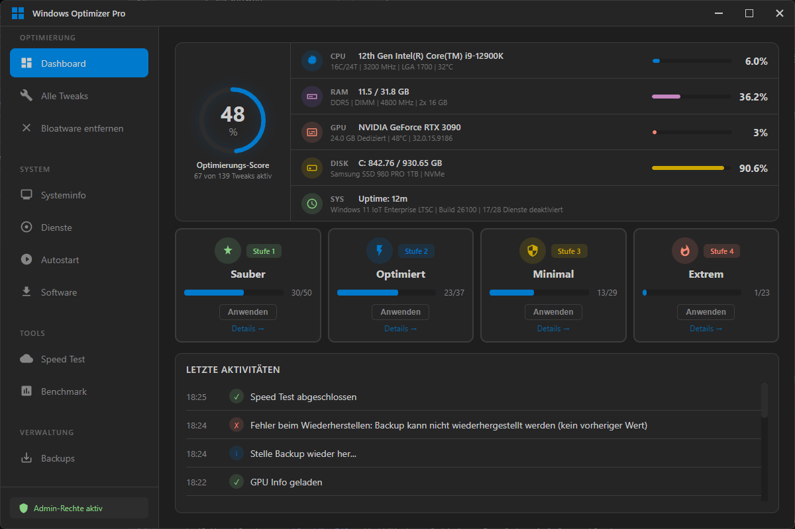
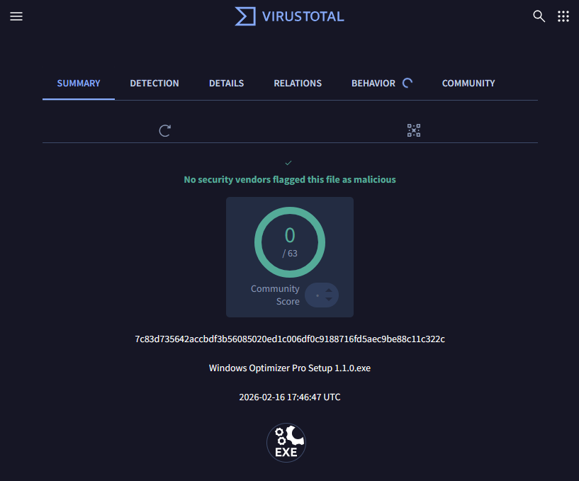

# Windows Optimizer Pro

Ein modernes, visuelles Tool zur Windows-Optimierung mit Fokus auf Datenschutz, Performance und Benutzerfreundlichkeit.

## ✨ Features

- **🔒 Datenschutz & Telemetrie** - Deaktiviere Windows-Telemetrie, Cortana, Standortverfolgung und mehr
- **⚡ Performance-Optimierung** - Verbessere die Systemleistung durch Registry-Tweaks
- **🛠️ Dienste-Management** - Verwalte Windows-Dienste um Ressourcen zu sparen
- **🗑️ Bloatware-Entfernung** - Entferne vorinstallierte Apps die du nicht brauchst
- **🎨 Moderne UI** - Dunkles, modernes Design mit Animationen und visuellen Feedback
- **💾 Automatische Backups** - Sichere Registry-Backups werden automatisch erstellt
- **📊 System-Überwachung** - Überwache CPU, RAM, Festplatten und Netzwerk in Echtzeit

## 📸 Screenshots

## 👤 Autor

**GoGo DevOps**
- GitHub: [@gogodevops](https://github.com/gogodevops)
- Email: gogodevelop@outlook.com

## 🙏 Danksagungen

- Electron Team für das großartige Framework
- Alle Contributors die an diesem Projekt mitarbeiten
- Windows-Community für Feedback und Support

## ⚖️ Disclaimer

Dieses Tool modifiziert Windows-Systemeinstellungen. Nutze es auf eigene Verantwortung. Erstelle immer Backups bevor du größere Änderungen vornimmst.

**Keine Verbindung zu Microsoft:** Dieses Projekt steht in keiner offiziellen Verbindung zu Microsoft und wird von Microsoft weder unterstützt noch empfohlen.

---

**Website:** https://github.com/gogodevops/winopt
**Entwickelt mit ❤️ für Windows 10/11**
